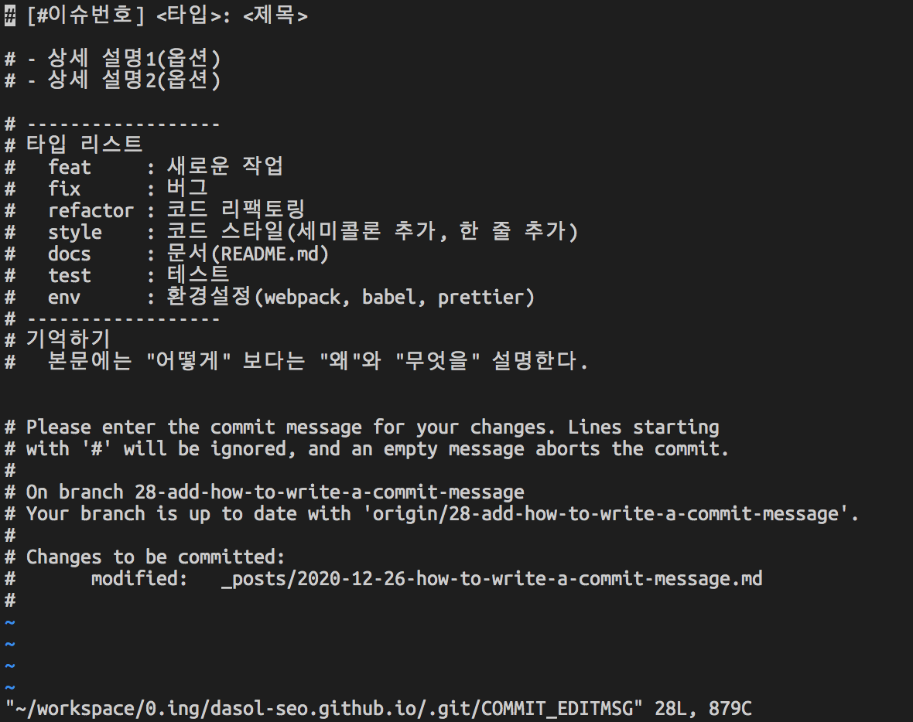

### 커밋 메시지 작성 규칙
```
# [#이슈번호] <타입>: <제목>
  
# - 상세 설명1(옵션)
# - 상세 설명2(옵션)

# ------------------
# 타입 리스트
#   feat     : 새로운 작업
#   fix      : 버그
#   refactor : 코드 리팩토링
#   style    : 코드 스타일(세미콜론 추가, 한 줄 추가)
#   docs     : 문서(README.md)
#   test     : 테스트
#   env      : 환경설정(webpack, babel, prettier)
# ------------------
# 기억하기
#   본문에는 "어떻게" 보다는 "왜"와 "무엇을" 설명한다.
```

### 커밋 메시지 템플릿 등록하기
ex. workspace/0.ing/dasol-seo.github.io 기준

- 아래의 코드 실행하기
```
$ cd .git
$ mkdir commit
$ vi .message // 해당 파일 안에 '커밋 메시지 작성 규칙' 내용 복사/붙여넣기
$ git config commit.template ~/workspace/0.ing/dasol-seo.github.io/.git/commit/.message
```
- 변경사항 저장 후 git commit 실행하기

